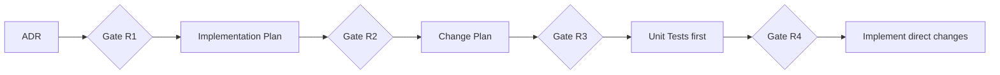

# .agents - Portable AI Governance Kit

A folder you copy into any repository. One command, `/agents-init`, adapts it
to that project's stack using the `grill-me` skill. From then on, it governs
every AI agent working in the repo: one workflow, one rule set, one agent
roster, automatic commands, and a growing library of parametrized scripts.

Agent- and harness-independent. Tested targets: Antigravity (Gemini models),
DSH (DeepSeek/MiMo models), Claude Code, Cursor.

## The pipeline

Five stages, four review gates. Only the user approves a gate.



Approval syntax: `APPROVED`, `Approve <gate-id>`, or
`Approved: <artifact-path>`. Generic words (ok, proceed, do it) are not
approval. Reviewer verdicts are advisory. Details: `.agents/workflow.md`.

## Install

Copy `.agents/` into your project root:

```bash
cp -r /path/to/dot-agents/.agents ./
```

## Initialize

Type in your agent:

```
/agents-init
```

(Or paste `.agents/prompts/init-project.md` for agents without custom slash command support).

The init agent runs the grill-me interview, explicitly asks which coding agent(s) you use (e.g. Antigravity, Claude Code, Cursor, DSH), generates root bootstrap pointer files for only those selected, fills project configuration templates, and configures test/lint runner scripts. Zero project code is touched.

Re-init is safe: existing customized files are never overwritten silently.

## Harness matrix

| Harness | Root pointer | Commands | Skills | Subagents |
|---------|--------------|----------|--------|-----------|
| DSH (DeepSeek/MiMo) | root AGENTS.md | dispatch rule | `.agents/skills/` natively | native |
| Antigravity (Gemini) | root AGENTS.md + GEMINI.md | dispatch rule | mapped at init | per harness docs |
| Claude Code | root CLAUDE.md (`@.agents/AGENTS.md`) | auto-registered from `commands/` | project skills | `agents/` frontmatter |
| Cursor | `.cursor/rules/agents.mdc` | command copies | reference material | per harness docs |

## Commands

All in `.agents/commands/`. Dispatch rule: when the user types `/name`, read
`commands/name.md` and follow it exactly.

| Command | Purpose |
|---------|---------|
| `/agents-init` | Initialize the kit for this project (grill-me interview) |
| `/new-adr <title>` | Create the next ADR (Gate R1) |
| `/new-implementation-plan <adr-ref>` | WHAT plan (Gate R2) |
| `/new-change-plan <impl-plan-ref>` | HOW plan (Gate R3) |
| `/new-tests <change-plan-ref>` | Tests first (Gate R4) |
| `/implement <change-plan-ref>` | Direct changes, green tests, report |
| `/code-review <path\|staged\|range>` | Structured review report |
| `/run-tests <unit\|integration\|all>` | Run the suite |
| `/completion-report <change-plan-ref>` | Write the report |
| `/update-context` | Refresh context.md |
| `/commit <summary>` | Format, stage, show, confirm, commit |
| `/pre-commit-checks` | Lint + fast tests |

`commands/KNOWN-BUILTINS.md` is the static collision list. Kit command names
are fixed; no runtime renaming.

## Scripts

`commands/scripts/` holds reusable parametrized scripts the agents create and
maintain (`.sh`/`.ps1` pairs or `.py`). Two-times rule: the third time the
agent repeats an action sequence, it scripts it. Parameters come from CLI
args, then env vars. Command files invoke scripts only through the wrappers
in `.agents/rules/scripts.md`.

## Skills

Bundled skills follow the standard progressive anatomy (`SKILL.md`, `scripts/`, `resources/`, `assets/`, `examples/`):
- `ponytail`, `grill-me`, `token-thrift`, `systematic-debugging`, `verification-before-completion`, `writing-plans`, `code-review-excellence`, `code-navigation`, `tdd-testing`, `skill-hunter`, `web-search`.

All skills are registered in `skills/MANIFEST.md` and committed to git.

## Structure

```
.agents/
├── AGENTS.md            entry point for every agent
├── USER.md              developer profile and preferences
├── workflow.md          the pipeline and gates
├── rules/               general rules + generated *_local.md
├── memory/              rolling daily logs (YYYY-MM-DD.md)
├── agents/              subagent definitions
├── commands/            command files + scripts/
├── prompts/             paste-in prompts
├── skills/              bundled + downloaded skills (scripts, resources, assets)
├── templates/           init templates (docs, rules, user profile)
├── architecture.md      filled at init (11 mandatory sections)
├── project_overview.md  filled at init
├── coding_standards.md  filled at init
├── credentials.md       filled at init (gitignored)
├── context.md           working memory, updated freely
└── settings.local.json  local permission overrides (gitignored)

docs/                    created at init
├── 00_adr/
├── 01_implementation_plans/
├── 02_change_plans/
└── 03_test_plans/
```
