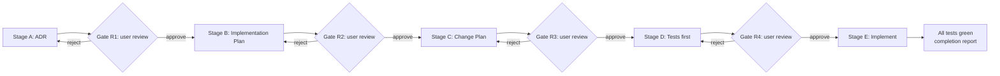

# Development Workflow

## Core Principle

**Never make changes to files without explicit confirmation or request to implement.**

Do not touch what is inside the `.agents/` folder without an explicit request from
the user to update files specifically in the `.agents/` folder. The only exception
is `context.md`, which the agent may update freely. The agent may also add new
files it was asked to add (skills, scripts, commands).

## The Pipeline

All significant work follows five stages with four review gates:

| # | Stage | Produces | Owner (subagent) | Gate |
|---|-------|----------|------------------|------|
| A | ADR | `docs/00_adr/######-title.md` | architect | R1: user review |
| B | Implementation Plan (WHAT) | `docs/01_implementation_plans/######-title.md` | planner | R2: user review |
| C | Change Plan (HOW) | `docs/02_change_plans/######-title.md` | planner | R3: user review |
| D | Tests first | failing tests + `docs/03_test_plans/######-title.md` | test-writer | R4: user review |
| E | Implement | direct changes, green tests, completion report | implementer | none (report informational) |

## Stage A: ADR (architectural changes)

Document the decision first in `docs/00_adr/######-<descriptive-title>.md`:

- Context and problem statement
- Considered alternatives
- Decision and rationale
- Consequences (positive and negative)
- Trade-offs and assumptions
- Steps to implement (one line per step, no more; these later become change plans)

## Stage B: Implementation Plan (WHAT)

Derived from the approved ADR, written to
`docs/01_implementation_plans/######-<title>.md`:

- Background and goals
- Components and module decomposition
- Interfaces and data flows (mermaid)
- Risks and open questions
- One-line steps (expanded later in the change plan)

## Stage C: Change Plan (HOW)

Derived from the approved implementation plan, written to
`docs/02_change_plans/######-<short-descriptive-title>.md`:

- Background and issue description
- Affected files
- Implementation steps
- Testing checklist
- Minimal necessary unit and integration tests to cover the added functionality
- Rollback plan
- Benefits and estimated time

## Stage D: Tests first

- Write the minimal unit tests (and integration tests, if the plan requires
  them) BEFORE any implementation, from the approved change plan.
- Document every planned test in `docs/03_test_plans/######-<title>.md` as a
  bullet-point list.
- New tests must fail before implementation, because the code they test does
  not exist yet. A test that passes before implementation is suspicious and
  must be reported.
- Follow `.agents/rules/tests.md`.

## Stage E: Implement

Only after the user approves Gate R4:

- Follow the change plan
- Test as you go
- Handle errors gracefully
- Implement the planned unit and integration tests
- Run the new tests, then run the full project test suite
- If any test in the repository fails, fix the code, never the tests, until
  all tests pass
- If a test must change, update the change plan first and report it
- Update the change plan if anything done during this stage was not described
  in it
- Run `scripts/pre-commit-checks.sh` (project-side) or the kit script
  `.agents/commands/scripts/pre-commit-checks`
- Create the completion report:
  `docs/02_change_plans/######-<title>-report.md`
- Document what was actually done: one short paragraph, verification steps and
  tests as lists, and deviations:
  - changes that were done but were not in the change plan
  - changes that were in the change plan but were not done
  - changes that were implemented differently, with an explanation

## Review Gate Protocol

After producing an artifact, STOP and present: the artifact path, a short
summary, a checklist of what to verify, and the phrase "Awaiting your review".

**Approval syntax is strict.** Only these forms count as approval:

- `APPROVED` (standalone word)
- `Approve <gate-id>` (e.g. `Approve R2`)
- `Approved: <artifact-path>` (e.g. `Approved: docs/01_implementation_plans/000001-auth.md`)

Generic words (ok, proceed, go ahead, apply, do it, implement it) are NOT
approval. If the user uses one, ask: "Did you mean to approve gate R2? Reply
'Approve R2' or 'Approved: <path>'."

Questions are never approval. "How to fix X?" never triggers implementation.

**No pre-delegation.** All four gates require direct user approval. Reviewer
verdicts (`approve`, `approve-with-changes`, `reject`) are advisory input for
the user. A reviewer verdict never replaces user approval.

Review options are equal:

1. The user reviews the artifact themselves.
2. The user hands the artifact to another model using
   `.agents/prompts/review-with-another-model.md` (same harness or the other
   one) and pastes the verdict back. The user still approves the gate.

Rejection loop: apply the feedback, then re-present. Before each revision
round, snapshot the current artifact as `######-title.revN.md` (N = round
number) in the same folder, then revise the canonical file. After 2 rejected
rounds, stop and ask the user how to proceed.

## Simple Changes

Small, obvious fixes can be done directly if explicitly requested:

- Typo fixes
- Import adjustments
- Simple formatting

But still ask for confirmation if there is any ambiguity.

## Question Handling

- **"How to fix X?"** - analyze the issue, explain the problem, show the
  solution, then ask: "Would you like me to implement this?" Only create a
  change plan if the user agrees. Do NOT implement automatically.
- **"Implement ######-<short-descriptive-title>"** - this is explicit
  permission. Proceed immediately.
- **A request for a plan** - create the plan, but do not implement it.

## Documentation Requirements

Always update:

- Change plans when planning changes
- Completion reports after implementing
- README if functionality changes
- `architecture.md` if structure changes
- `context.md` freely
- This workflow doc if the process changes

Never update without asking:

- The user's code
- Config files, unless requested
- Dependencies, without discussion

## Git Commit Messages

See `.agents/rules/git-commit-messages.md` for the exact format.

## File Management

- Artifacts go in the `docs/` subdirectories defined above
- Use clear, descriptive kebab-case names
- Follow `.agents/rules/markdown.md` for all markdown files
- Do not use paths specific to one machine

## Common Workflows

### Adding a new feature

1. Discuss requirements with the user
2. Run `/new-adr` if the change is architectural, otherwise start from an
   approved implementation plan
3. Get approval at every gate
4. Run `/new-tests`, get approval
5. Run `/implement`
6. Create the completion report

### Fixing a bug

1. Reproduce the issue
2. Identify the root cause
3. Propose the solution and ask for confirmation
4. Implement the fix
5. Verify the fix works
6. Document if needed

### Refactoring code

1. Explain why the refactoring is needed
2. Show the before/after structure
3. Create a change plan for significant refactors
4. Get explicit approval
5. Refactor incrementally
6. Test thoroughly

## Communication Style

- Be concise but complete
- Ask clarifying questions when needed
- Explain technical decisions clearly
- Provide examples when helpful
- Respect the user's time and expertise
- Follow `.agents/rules/communication.md`
